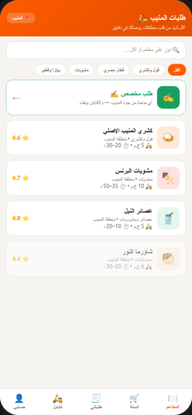
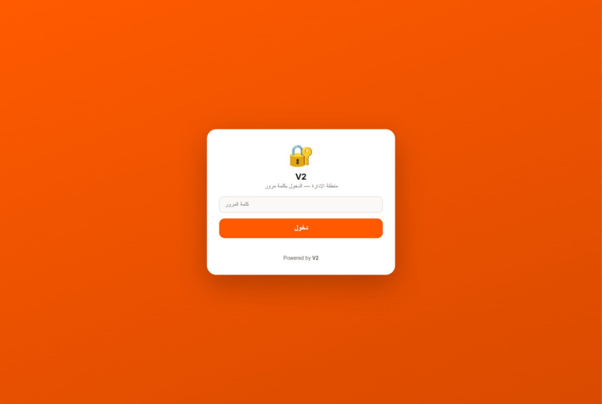
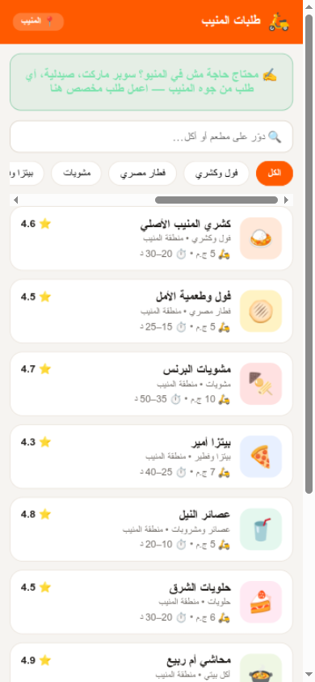
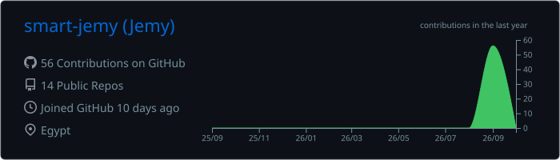
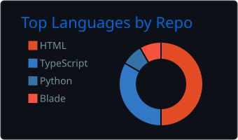
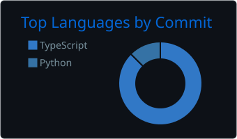
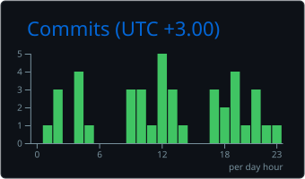

 

 

---

## 💫 About Me

- 🔐 **Penetration Tester** — web application pentesting, network security & vulnerability assessment
- 💻 **Full-Stack Developer** — management systems, e-commerce stores, dashboards & web design
- ⚙️ **Computer Engineer** — I build it, I break it, then I secure it
- 🌍 Working with clients worldwide — open for remote projects & collaborations

---

## ⭐ Pinned — CloudFail-Killer (CloudKill)

### 🔓 [CloudKill — Origin IP Discovery](https://github.com/smart-jemy/cloudfail-killer)

**My flagship security tool.** Multi-source, IPv6-native reconnaissance that finds origin
servers hidden behind Cloudflare — 15+ passive & active data sources, a 6-stage enrichment
pipeline, and confidence-scored results. Built for pentesters & bug bounty hunters.

`crt.sh` · `Shodan` · `Censys` · `Wayback` · `URLScan` · `DNSDumpster` · `GitHub Dorking` · signed reports (ed25519) · plugin sources · CI mode

---

## 🌐 Live Systems

| ✦ | System | Stack |
|---|---|---|
| 🍳 | **[Gadgeta — Magic & Innovation](https://gadgate.vercel.app)** | Next.js 16 · Prisma · Neon Postgres |
| 👞 | **[Yalla Shiaka — Shoes Store](https://yallashiaka.vercel.app)** | Next.js 16 · Prisma · Admin & Supervisors |
| 🔧 | **[Noor Center — Maintenance System](https://noorcenter.gt.tc)** | Laravel · MySQL · Role-based |
| 🛵 | **[اطلبني — Zone Delivery App](https://otlobni.surge.sh)** | Android APK · Web App · Admin Panel · V2 |
| 💼 | **[My Portfolio](https://jemyv2.vercel.app)** | Next.js 16 · React 19 · Hidden Analytics Panel |

---

## 🛵 Spotlight — اطلبني (Latest Release)

**📱 امسح الكود واطلب من المنيب فوراً**

**أول زون-ابليكيشن في مصر** — منصة توصيل مخصوصة لمنطقة المنيب بالكامل:
مطاعم بتدير منيوهاتها بنفسها + أي طلبات يومية (سوبر ماركت · صيدلية · مشاوير) + كباتن من أهل المنطقة بإسناد لحظي + لوحة تحكم كاملة — **بصفر تكاليف سيرفر**.

| تطبيق أندرويد | لوحة تحكم الإدارة | طلب أونلاين |
|---|---|---|
|  |  |  |

📌 **[الموقع الحي](https://otlobni.surge.sh/)** · **[📥 تحميل APK v2.1](https://files.catbox.moe/q7n2tf.apk)** · **[📖 Case Study كاملة](https://jemyv2.vercel.app/projects/moneib-delivery)** · **[الكود (خاص)](https://github.com/smart-jemy/moneib-talabat)**

**جديد v2.1:** بوابة أصحاب المطاعم (كل مطعم يدير منيوه وأسعاره وصور أصنافه من التطبيق) · إسناد الأوردرات للكباتن بمهلة قبول 30 ثانية وإعادة توجيه تلقائية · تصعيد واتساب تلقائي للإدارة بعد 5 دقايق من غير استلام · أرشفة شهرية تحافظ على البيانات مهما كبرت.

**تجربة كاملة لايف:** تطبيق أندرويد + موقع طلب + لوحة إدارة + نظام كباتن معتمدين — شغالة على منطقة حقيقية، والبنية جاهزة للتوسع لمناطق جديدة.

---

## 🛡️ Cybersecurity Arsenal

---

## 💻 Tech Stack

**Frontend & UI**

**Backend & Databases**

**Tools & DevOps**

**Mobile & Delivery**

---

## 🚀 Featured Projects

| Project | About |
|---|---|
| 🔓 **[CloudFail-Killer (CloudKill)](https://github.com/smart-jemy/cloudfail-killer)** | ⭐ **Flagship security tool** — origin-IP discovery behind Cloudflare · 15+ sources · 343 tests · SARIF & signed reports |
| 🛵 **[Otlobny — اطلبني](https://github.com/smart-jemy/moneib-talabat)** → [**LIVE**](https://otlobni.surge.sh/) | 🚀 Zone-locked delivery platform — Android (native Java) · Web · Admin dashboard · Restaurant self-service portal · 30s live dispatch · GitHub-backed data · 0 security findings |
| [**Portfolio Website**](https://github.com/smart-jemy/portfolio-website) → [**LIVE**](https://jemyv2.vercel.app) | 💼 Bilingual (AR/EN) portfolio — Next.js 16 · React 19 · hidden analytics panel |
| [**Gadgeta Store**](https://github.com/smart-jemy/gadgeta) → [**LIVE**](https://gadgate.vercel.app) | 🍳 Magic & Innovation e-commerce — golden deals · coupons · Neon Postgres |
| [**Yalla Shiaka Store**](https://github.com/smart-jemy/khatwa-store) → [**LIVE**](https://yallashiaka.vercel.app) | 🥾 E-commerce with admin & supervisor dashboards — Next.js · Prisma |
| [**TaskFlow**](https://github.com/smart-jemy/TaskFlow) | ✅ Production-grade multi-tenant task management — OCC · AI-powered · 462 tests |
| [**Noor Center**](https://github.com/smart-jemy/noor-center) → [**LIVE**](https://noorcenter.gt.tc) | 🔧 Maintenance-center management system — Laravel · MySQL · roles |
| [**Cinematic Landings**](https://github.com/smart-jemy/monolith-landing) | ⬡ MONOLITH · OBLIVION · ECHO · NOVA — WebGL experiences, zero build |

---

## 📊 GitHub Stats

 

🔄 self-rendered daily by GitHub Actions — never rate-limited

---

## 🏆 Achievements

---

## 🤝 Let's Connect

**Open for** pentest engagements 🔐 • full-stack builds 💻 • collaborations 🤝

*Find a vulnerability in my code? Congrats — you passed the first test.* 😏

---

<picture>
  <source media="(prefers-color-scheme: dark)" srcset="https://raw.githubusercontent.com/smart-jemy/smart-jemy/output/github-snake-dark.svg">
  <source media="(prefers-color-scheme: light)" srcset="https://raw.githubusercontent.com/smart-jemy/smart-jemy/output/github-snake.svg">
  
</picture>
